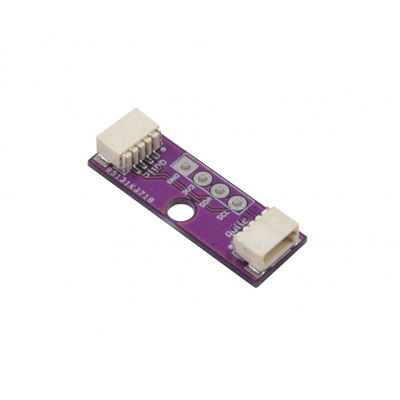

# Zio Qwiic Adapter

> This product can be available for purchase [here](https://www.smart-prototyping.com/Zio-Qwiic-Adapter.html).

#### Description

This useful little board will help you connect non-Qwiic-enabled boards with Qwiic-enabled modules.

Just solder your desired standard-pitch four-pin header to the board, and you’ve tapped into the Qwiic bus for breadboarding or connecting directly to modules without Qwiic connectors built in.

Two Qwiic connectors are set up for direct daisy-chaining with the attached module.

#### Specification

* Weight: 5g
* Dimension: 25.4x 8.6mm

#### Links

* [Eagle files](https://github.com/ZIOCC/Qwiic_Adapter)

> ###### About Zio
> Zio is a new line of open sourced, compact, and grid layout boards, fully integrated for Arduino and Qwiic ecosystem. Designed ideally for wearables, robotics, small-space limitations or other on the go projects. Check out other awesome Zio products [here](https://www.smart-prototyping.com/Zio).

> This board is a derivative of [Sparkfun's Qwiic Adapter](https://github.com/sparkfun/Qwiic_Adapter).

> All Zio products are released under the Creative Commons Attribution, Share-Alike License, and in accordance with the principles of the Open Source Hardware Association's OSHW Statement of Principles 1.0 and OSHW Definition 1.0. https://creativecommons.org/licenses/by-sa/4.0/ (English) 
https://creativecommons.org/licenses/by-sa/4.0/deed.zh (中文) 
https://www.oshwa.org/definition/ 
https://www.oshwa.org/definition/chinese/ (中文) 
